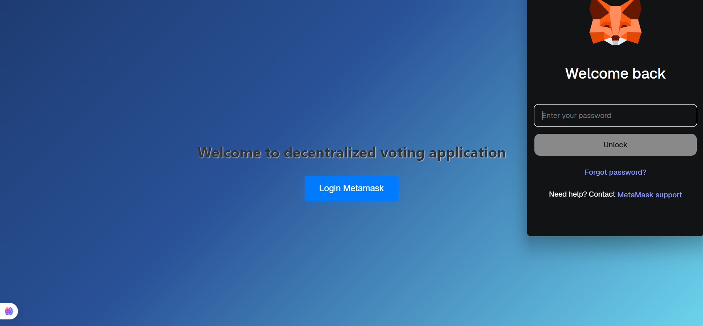
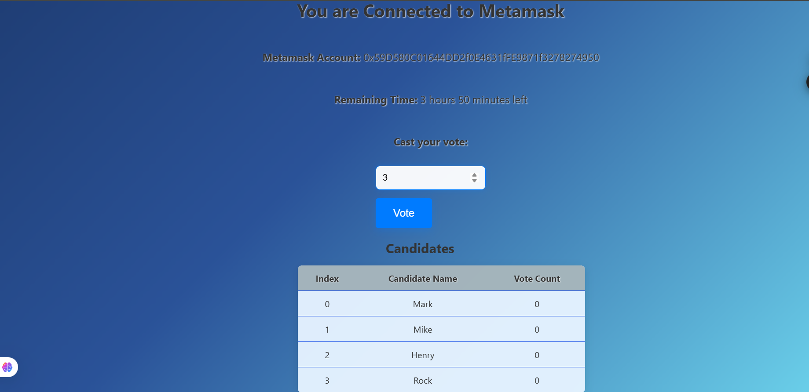
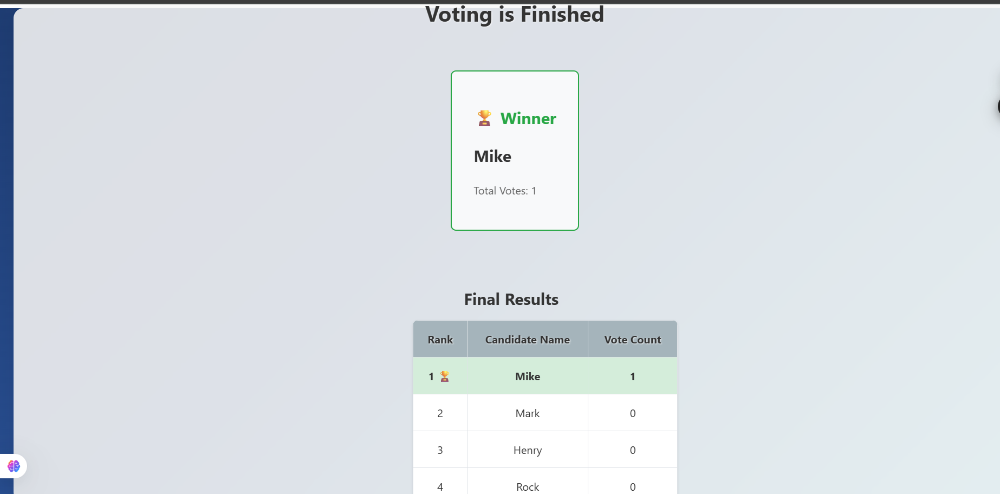
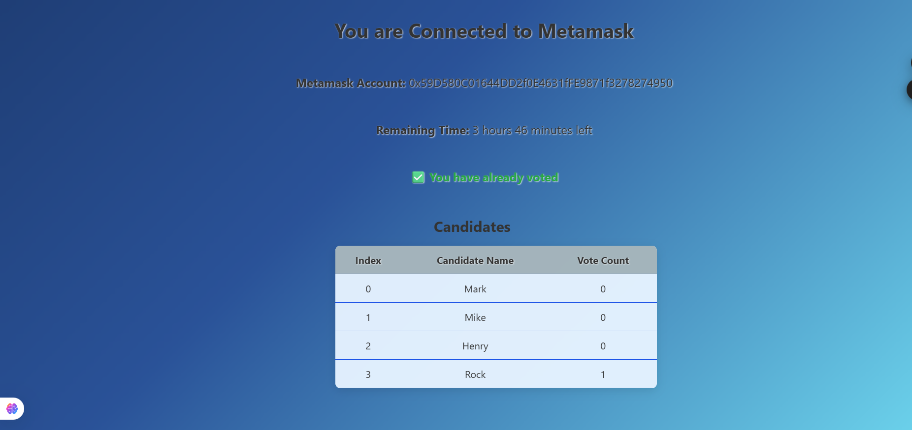
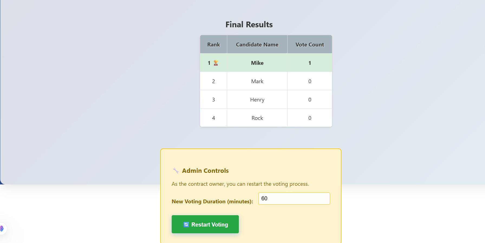

# VoteChain - Decentralized Voting App (React + Solidity)

Welcome to **VoteChain**, a fully decentralized voting application built using **Solidity**, **Hardhat**, and **React.js**. This DApp demonstrates how blockchain technology can be used to build transparent and secure election systems. Whether you’re a blockchain enthusiast or a hiring manager, this project reflects my capabilities in smart contract development, Ethereum-based DApp integration, and frontend logic using Web3.

## 🗳️ About the Project

VoteChain is a transparent voting system deployed on the Ethereum blockchain. It features a seamless React frontend that connects to MetaMask for wallet authentication. The DApp allows voters to cast their vote for registered candidates, shows real-time voting progress, and concludes with the declaration of the winning candidate. Admins (contract owners) can control the lifecycle of the election (start/restart voting) securely via smart contracts.

## 🔑 Core Features

- **MetaMask Login**: Secure Ethereum wallet authentication using MetaMask.
- **Real-Time Voting System**: Voters can vote using the index of the candidate.
- **Voting Progress UI**: Displays all candidates, their votes, and leading candidate info.
- **Admin Controls**: Contract owner can end voting and restart elections with a new duration.
- **Winner Declaration**: Automatically determines the winner at the end of the voting session.
- **Responsive UI**: Optimized frontend built using React.

## 🔧 Tech Stack

- **Smart Contracts**: Solidity
- **Blockchain Environment**: Hardhat
- **Frontend Framework**: React.js
- **Wallet Connection**: MetaMask + ethers.js
- **Development Tools**: Hardhat, Visual Studio Code, Node.js
- **Version Control**: Git & GitHub

## 📽️ Working of the App

- 🧑 **Login Page**: Connect MetaMask wallet using Web3. User is redirected to the connected page on successful login.
- 👥 **Connected Page**: Displays the list of candidates. Users can vote by entering the index of the candidate.
- ⏱️ **Finished Page**: Shows a table of all candidates with their vote counts and the winning candidate.
- 🔐 **Admin Access** (Only Contract Owner): Can restart the voting process for a specific time duration using a UI control, triggering the `restartVoting()` method in the smart contract.

## 📸 Screenshots

  
  
  
  
  

## 🔮 Future Enhancements
- Add voter verification using ENS or email-auth.

- Add countdown timer to show voting duration.

- Push voting results to IPFS for immutability.

- Add charts to display votes visually.

## Contact

I’m open to opportunities and collaborations!  
📧 Reach out to me at [saicharanchilla7777@gmail.com](mailto:saicharanchilla7777@gmail.com)  
🔗 Connect with me on [LinkedIn](https://www.linkedin.com/in/saicharan-chilla-2b2201271/)  
💻 Check out more of my work on [GitHub](https://github.com/228w1a1278)
